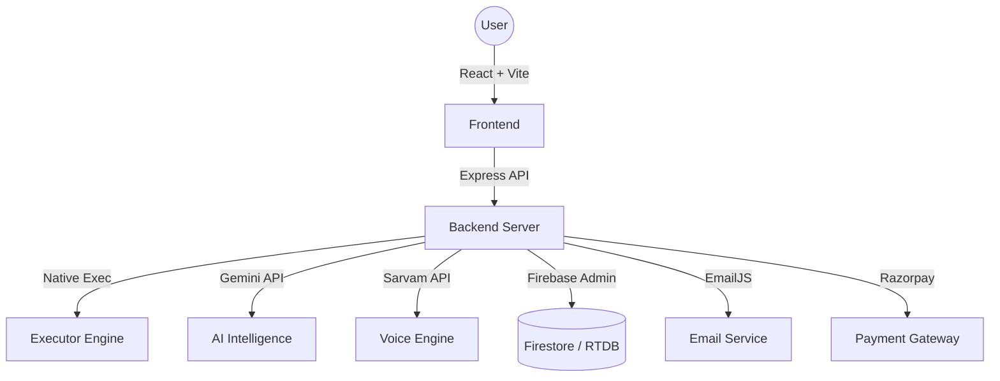

# Whizan: The Intelligent Technical Interview Ecosystem

Whizan is a comprehensive, AI-first platform designed to bridge the gap between competitive programming and real-world technical interviews. It provides a multi-tenant environment where candidates can practice DSA in 7+ languages, receive real-time AI guidance, and undergo rigorous mock interviews with Staff Engineer-level feedback.

## 🌟 Platform Core Pillars

### 🎙️ AI-Powered Interview Suites
- **Adaptive DSA Interviews**: A state-aware AI interviewer that guides you through requirement gathering, brute-force analysis, optimization, and bug-free implementation. It uses Socratic hinting to help you progress without giving away answers.
- **System Design Architect**: Engage in high-level architectural debates. The platform integrates a real-time whiteboard where AI can highlight components, suggest trade-offs, and evaluate scalability across millions of users.
- **Sarvam AI Voice Integration**: High-fidelity, low-latency Text-to-Speech (TTS) provides a human-like voice experience, making mock interviews feel authentic.

### 💻 Robust Code Execution Engine
- **7-Language Support**: High-performance native execution for **Python, JavaScript, C++, C, Java, Go, and Rust**.
- **Test-Driven AI Generation**: Instant generation of problem-specific boilerplate, stdin-handling wrappers, and exhaustive test cases (up to 15+ edge/corner cases per problem).
- **Native Performance**: Code runs in isolated temporary environments on the server with strict 15-second timeouts and resource limits.

### 📜 AI Resume & Portfolio Intelligence
- **Vision-Based Resume Parsing**: Upload a PDF or Image; Gemini Vision extracts your experience, skills, and projects into a structured profile.
- **GitHub README Spotlight**: Provide a GitHub URL, and Whizan’s AI analyzes the README to extract features, tech stacks, and architecture for a professional showcase.
- **Public Developer Profiles**: A centralized hub to showcase your interview scores, solved problem distributions (Easy/Medium/Hard), and project highlights.

### 🛡️ Enterprise-Grade Admin Portal
- **Infrastructure Health**: Real-time monitoring of CPU, Memory (RSS/Heap), Uptime, and Database connectivity.
- **Omnichannel Campaigns**: Manage notifications via a live Feed, Popups, Banners, or Announcements with Firebase Cloud Messaging (FCM) push support.
- **Direct DB Control**: A secure interface to inspect, edit, or delete any document across Firestore and Realtime Database.

---

## 🏗 System Architecture



## 📂 Project Organization

```text
├── backend/                # Node.js / Express Core
│   ├── routes/             # Unified Routing Layer (Admin, Notifications)
│   ├── ai.js               # Structured Prompting & Gemini Logic
│   ├── executor.js         # Language-specific Code Execution
│   ├── interview.js        # Interview State Machine & Evaluators
│   ├── scraper.js          # LeetCode Sync Logic (Dockerized/Native)
│   └── server.js           # API Entry & Cron Schedules
├── src/                    # React / Vite Frontend
│   ├── admin/              # Comprehensive Admin Dashboard
│   ├── components/         # Reusable Atomic UI Components
│   ├── contexts/           # Auth, Global State, & Real-time Listeners
│   ├── hooks/              # Custom Logic (Interviews, Submissions)
│   └── App.jsx             # React Router Map
└── .github/workflows/      # Automation & Infrastructure Maintenance
```

---

## ⚡ Quick Start (Development)

1. **Clone & Install**:
   ```bash
   npm install
   cd backend && npm install
   ```

2. **Environment Configuration**:
   Create a `.env` in `/backend` with:
   - `GEMINI_API_KEY_1-7`: Load-balanced AI keys.
   - `FIREBASE_SERVICE_ACCOUNT_KEY`: Service account JSON for Admin access.
   - `SARVAM_API_KEY`: For Audio streaming.

3. **Run Services**:
   - Backend: `npm start` (inside `/backend`)
   - Frontend: `npm run dev` (root directory)

---

Detailed technical specifications, including full API and Database catalogs, can be found in **[TECHNICAL_REFERENCE.md](file:///Users/ayushjaiswal/Desktop/AI%20INTERVIEW%20%20main%20%20/TECHNICAL_REFERENCE.md)**.
